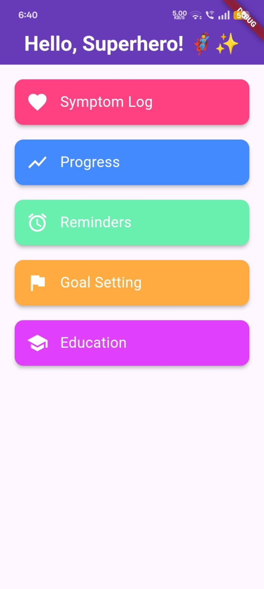
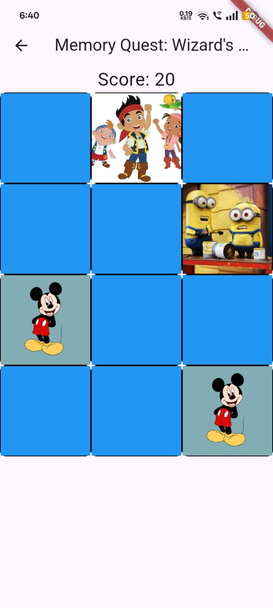
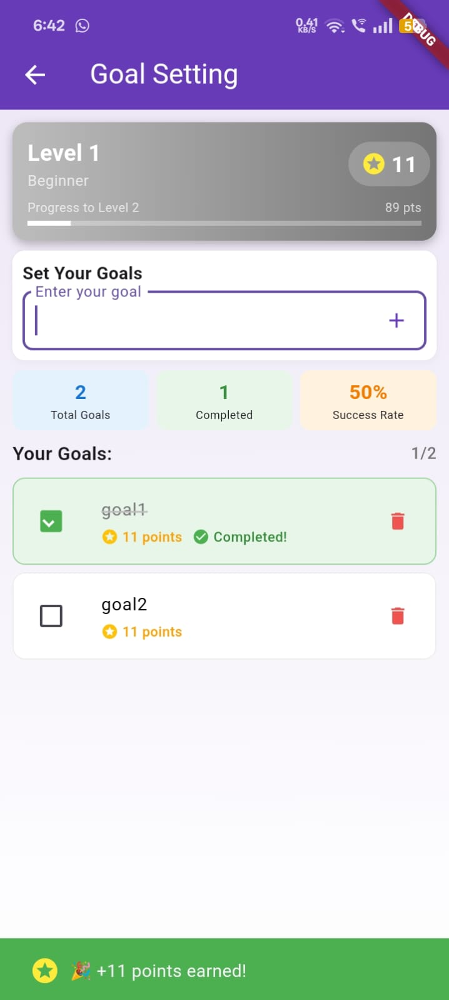
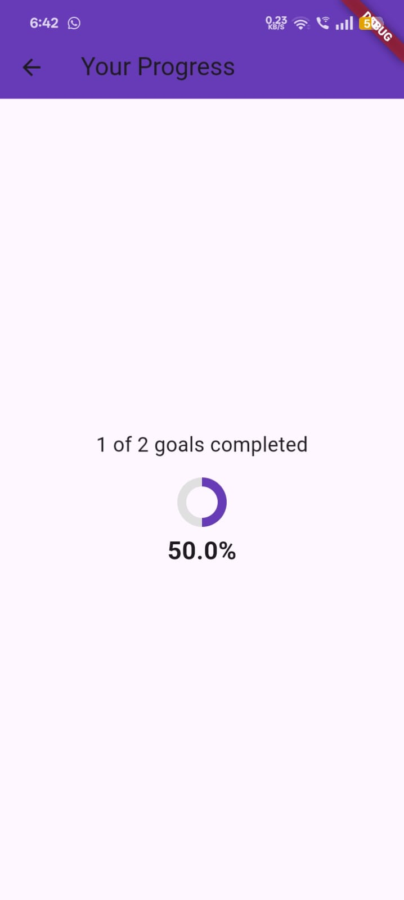
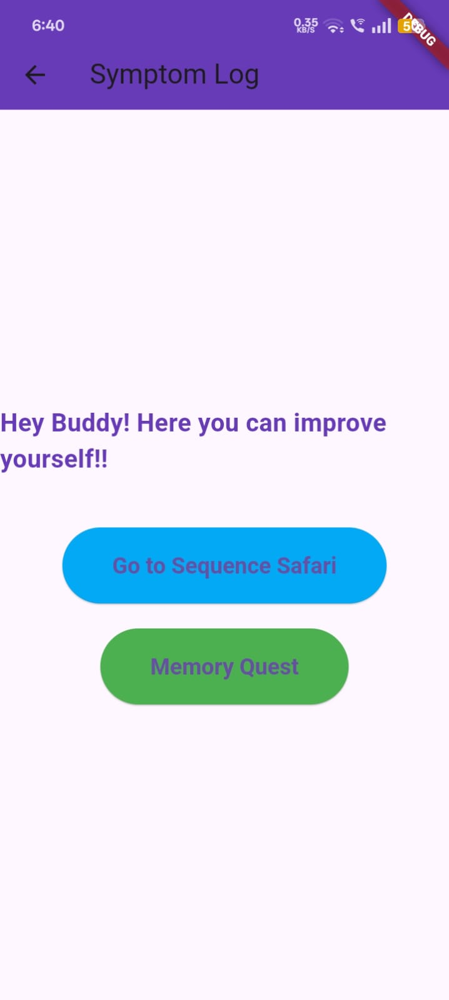
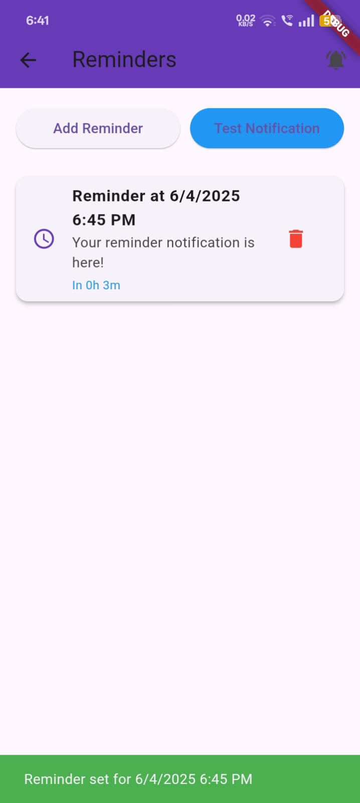
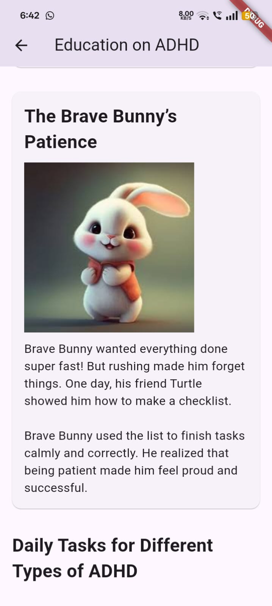
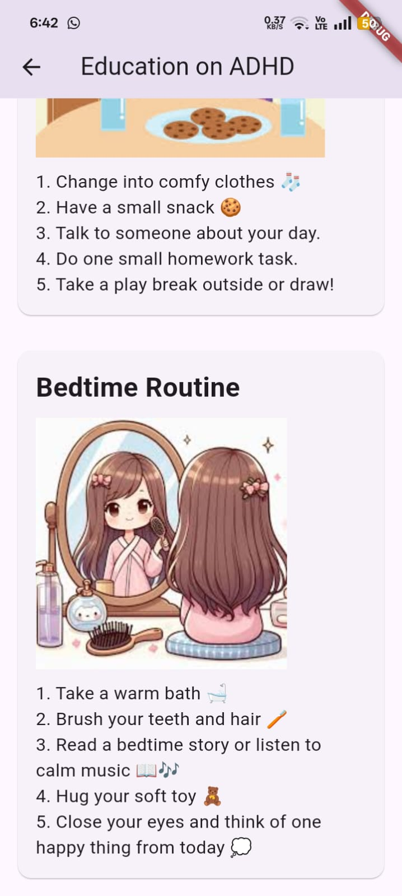
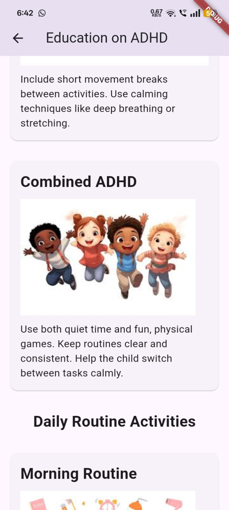
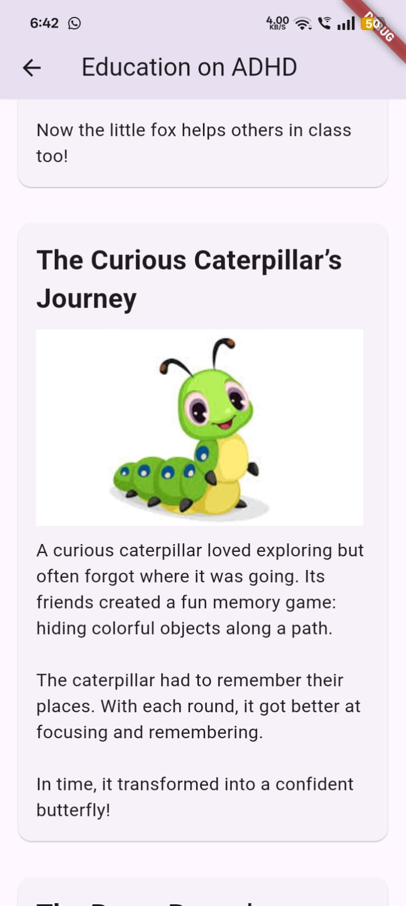

<h1 align="center">🎯 ADHD Management Companion App</h1>
<p align="center"><i>A Personalized Tool for Symptom Management</i></p>

---

## 🧠 About the Project

This app is designed to help individuals—especially children—manage ADHD symptoms with a focus on:
- 🎯 Task management
- 🧩 Daily routines
- 📚 ADHD education
- 🔔 Smart reminders
- ✅ Goal tracking

It provides a fun, interactive way to stay organized without collecting personal data.

---

## 🚀 Features

| 💡 Feature               | ✅ Description                                                  |
|-------------------------|-----------------------------------------------------------------|
| 🎯 Goal Setting         | Set personalized and achievable daily goals                     |
| 📅 In-app Calendar      | Visualize and organize tasks and reminders                      |
| ⏰ Smart Reminders       | Stay on track with gentle, motivating nudges                    |
| 📊 Progress Tracking     | Track improvements and stay motivated                          |
| 🔐 100% Privacy         | No external data collection; safe for children                  |

---

## 🔬 Research Hypothesis

> A **personalized ADHD management app** improves focus, task organization, and productivity by promoting structured routines and reducing distractions.

---

## 📈 Methodology

```

Phase 1: Design & Planning
↳ User research and UI/UX planning

Phase 2: Development
↳ Build Android app with planned features

Phase 3: Evaluation
↳ Collect feedback and iterate

```

---

## 📊 Results

- ✅ Effective at helping users manage tasks
- 💬 Positive user reviews (fast, fun, simple)
- 📱 User-friendly for both kids and adults
- 🌟 Boosts productivity and daily organization

---

## 🏁 Conclusion

This solution addresses the need for **non-invasive ADHD support tools**.  
By integrating task tracking, reminders, and goal setting, this app helps users build structure and thrive daily.

> 🌟 "Helping users stay focused, organized, and on track—one tap at a time."

## 📷 App Screenshots

> Here's a quick preview of key features in the **ADHD Management Companion App**:

### 🏠 Home Screen


---

### 🧩 Puzzle Game


---

### 🎯 Goals Section


---

### 📊 Progress Tracker


---

### 🧠 Brain Games


---

### 🦁 Safari Adventure Module


---

### 🔔 Reminders & Notifications


---

### 📚 Interactive Stories

#### 📖 Story 1


#### 📖 Story 2


#### 📖 Story 3


#### 📖 Story 5



## 📬 Contact

> For queries or collaboration: **sahithyamadala@gmail.com**
